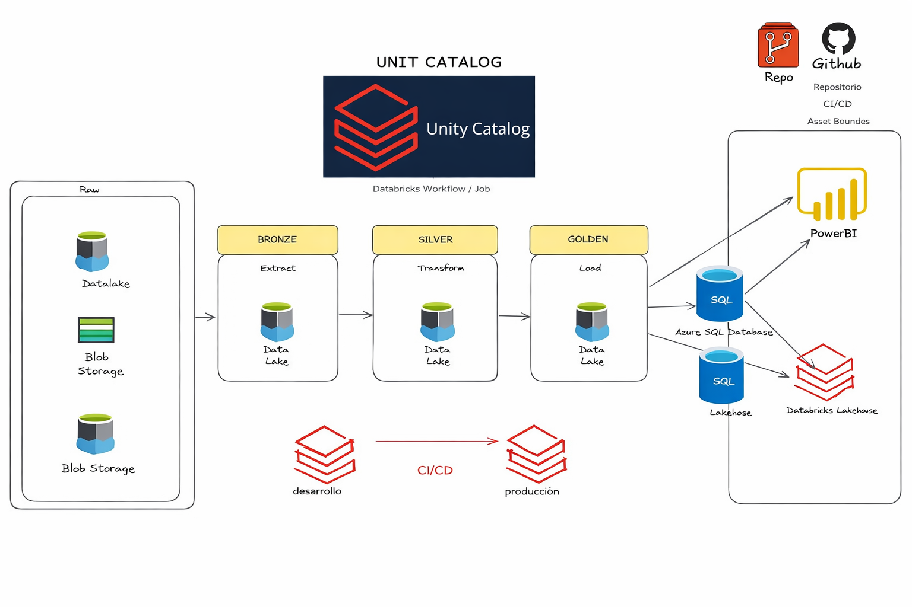
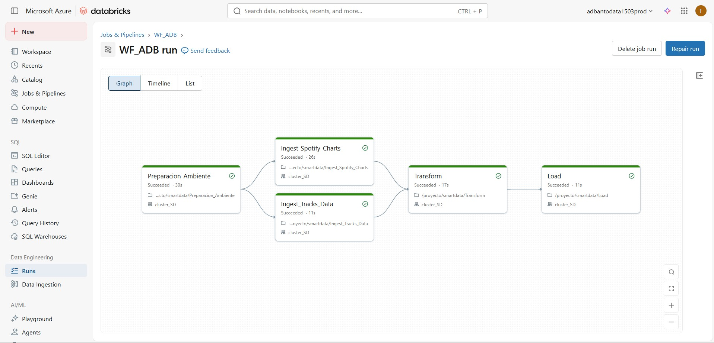

# PROYECTO_DATABRICKS
Proyecto final curso Ingeniería de datos e IA con Databricks - SmartData


#Spotify Medallion ETL Pipeline
## Arquitectura Medallion en Azure Databricks

Pipeline automatizado de datos para analisis de canciones y charts de Spotify implementando la Arquitectura Medallion (Bronze-Silver-Golden) en Azure Databricks con Unity Catalog, Delta Lake y despliegue continuo via GitHub Actions.

---

## Descripcion

Pipeline ETL que transforma datos crudos de dos fuentes Spotify:
- Ranking historico de las 100 canciones mas escuchadas de todos los tiempos (`spotify_alltime_top100_songs.csv`)
- Wrapped 2025 con las 50 canciones del año (`spotify_wrapped_2025_top50_songs.csv`)

Implementa la Arquitectura Medallion en Azure Databricks con Delta Lake para garantizar consistencia ACID.

---

## Arquitectura

```
CSV Raw Data (ADLS Gen2)
    |
Bronze Layer  (Ingesta sin transformacion)
    |
Silver Layer  (Limpieza + Transformaciones + Join)
    |
Golden Layer  (Agregaciones de negocio)
```

---

## Capas del Pipeline

### Bronze Layer
Proposito: Zona de aterrizaje

Tablas:
- `spotify_tracks` — Datos del ranking historico alltime top 100
- `spotify_daily_charts` — Datos del Wrapped 2025 top 50

Caracteristicas:
- Datos tal como vienen del origen
- Timestamp de ingesta
- Sin validaciones ni transformaciones
- Schema explicito definido con PySpark

### Silver Layer
Proposito: Datos limpios y enriquecidos

Tablas:
- `spotify_transformed` — Join de tracks con charts mas columnas derivadas

Transformaciones aplicadas:
- Limpieza de nulos
- UDF de categoria de popularidad (Baja / Media / Alta)
- Calculo de dias desde el chart (`days_since_chart`)
- Clasificacion de mercado (`market_type`: Major Market / Global Market)
- Clasificacion de duracion (`track_duration_type`: Long Track / Standard Track)

### Golden Layer
Proposito: Analytics-ready

Tablas:
- `spotify_final_summary` — Agregacion por fecha con metricas de streams, pais, mercado y nivel de popularidad

---

## Estructura del Proyecto

```
spotify-medallion/
|
├── .github/
│   └── workflows/
│       └── deploy.yml                   # Pipeline CI/CD GitHub Actions
├── Preparacion_Ambiente.ipynb           # Creacion de catalog, schemas y tablas Delta
├── Ingest_Tracks_Data.ipynb             # Bronze: spotify_alltime_top100_songs.csv
├── Ingest_Spotify_Charts.ipynb          # Bronze: spotify_wrapped_2025_top50_songs.csv
├── Transform.ipynb                      # Silver: limpieza, join y enriquecimiento
├── Load.ipynb                           # Golden: agregaciones finales
└── README.md
```

---

## Fuentes de Datos

| Archivo | Descripcion | Columnas clave |
|---|---|---|
| `spotify_alltime_top100_songs.csv` | Ranking historico de canciones | alltime_rank, song_title, artist, total_streams_billions |
| `spotify_wrapped_2025_top50_songs.csv` | Wrapped 2025 top 50 | wrapped_2025_rank, song_title, streams_2025_billions |

Ubicacion en ADLS: `abfss://raw@adlsantodata1703.dfs.core.windows.net/`

---

## Requisitos Previos

- Cuenta de Azure con acceso a Databricks
- Workspace de Databricks con Unity Catalog habilitado
- Cluster activo (`cluster_SD`)
- Azure Data Lake Storage Gen2 configurado (`adlsantodata1703`)
- External Location configurada sobre `unit-catalog` para managed storage
- Cuenta de GitHub con permisos de administrador en el repositorio

---

## Configuracion de Infraestructura

El catalogo `catalog_au` usa managed storage en:
```
abfss://unit-catalog@adlsantodata1703.dfs.core.windows.net/catalog_au/
```

Schemas creados con MANAGED LOCATION explicita:
```
catalog_au.raw
catalog_au.bronze
catalog_au.silver
catalog_au.golden
catalog_au.exploratory
```

---

## Orden de Ejecucion Manual

```
1. Preparacion_Ambiente.ipynb    -- Crear schemas y tablas Delta
2. Ingest_Tracks_Data.ipynb      -- Cargar alltime top 100 a Bronze
3. Ingest_Spotify_Charts.ipynb   -- Cargar Wrapped 2025 a Bronze
4. Transform.ipynb               -- Transformar y join a Silver
5. Load.ipynb                    -- Agregar y cargar a Golden
```

---

## CI/CD con GitHub Actions



### Como funciona

Cada vez que se hace un push a la rama `main`, el workflow de GitHub Actions ejecuta automaticamente los siguientes pasos:

```
Push a main
    |
Exportar notebooks desde workspace de desarrollo
    |
Desplegar notebooks al workspace de produccion (/proyecto/smartdata)
    |
Eliminar workflow WF_ADB anterior si existe
    |
Buscar cluster existente cluster_SD
    |
Crear workflow WF_ADB con las 5 tareas en orden
    |
Ejecutar WF_ADB automaticamente
    |
Monitorear ejecucion por hasta 10 minutos
```

### Workflow WF_ADB

El workflow creado en Databricks tiene 5 tareas con dependencias en cadena:

```
Preparacion_Ambiente
        |
   _____|_____
   |         |
Ingest_    Ingest_
Tracks_    Spotify_
Data       Charts
   |         |
   |_________|
        |
    Transform
        |
      Load
```

Ingest_Tracks_Data e Ingest_Spotify_Charts corren en paralelo despues de Preparacion_Ambiente. Transform espera a que ambos terminen antes de ejecutarse.

### Configuracion de GitHub Secrets

En tu repositorio ve a: Settings → Secrets and variables → Actions

| Secret | Descripcion | Ejemplo |
|---|---|---|
| `DATABRICKS_ORIGIN_HOST` | URL del workspace de desarrollo | `https://adb-xxxx.azuredatabricks.net` |
| `DATABRICKS_ORIGIN_TOKEN` | Token del workspace de desarrollo | `dapi_xxxxxxxx` |
| `DATABRICKS_DEST_HOST` | URL del workspace de produccion | `https://adb-yyyy.azuredatabricks.net` |
| `DATABRICKS_DEST_TOKEN` | Token del workspace de produccion | `dapi_yyyyyyyy` |

### Como generar un Databricks Token

1. Ir a Databricks Workspace
2. Click en tu perfil (esquina superior derecha)
3. Settings → Developer → Access Tokens
4. Click en Generate New Token
5. Comment: `GitHub CI/CD` — Lifetime: `90 days`
6. Copiar y guardar el token inmediatamente

### Pasos del yml explicados

| Paso | Descripcion |
|---|---|
| Checkout Repository | Clona el repositorio en el runner de GitHub |
| Export notebooks | Exporta los 5 notebooks desde el workspace de desarrollo en formato SOURCE |
| Deploy notebooks | Importa los notebooks al workspace de produccion en `/proyecto/smartdata` |
| Check workflow exists | Busca si ya existe WF_ADB y lo elimina para evitar duplicados |
| Get cluster ID | Busca el cluster `cluster_SD` por nombre y obtiene su ID dinamicamente |
| Create workflow WF_ADB | Crea el workflow con las 5 tareas, dependencias y parametros configurados |
| Validate workflow | Verifica que el workflow se creo correctamente y muestra el resumen de tareas |
| Execute workflow | Dispara la ejecucion del workflow WF_ADB via API |
| Monitor execution | Monitorea el estado cada 30 segundos por un maximo de 10 minutos |
| Clean up | Elimina archivos temporales del runner |

---

## Monitoreo

### En Databricks

Ir a `Workflows` en el menu lateral y buscar `WF_ADB`. Desde ahi se puede ver el historial de ejecuciones, el estado de cada tarea y los logs detallados por notebook.

### En GitHub Actions

Ir al tab `Actions` del repositorio. Cada push genera una ejecucion nueva donde se puede ver el log de cada paso incluyendo el estado final del workflow en Databricks y la duracion total.

---

## Stack Tecnologico

- Azure Databricks (PySpark)
- Azure Data Lake Storage Gen2
- Unity Catalog
- Delta Lake
- Azure Data Factory (orquestacion)
- Key Vault (seguridad)
- GitHub Actions (CI/CD)
- GitHub (control de versiones)
